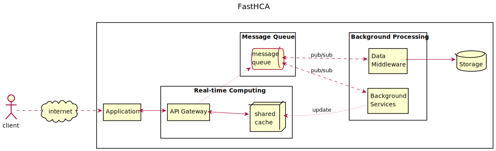

### A Lightweight, High-Concurrency, Real-Time, and Easy to Implement model for medium scale C/S systems.

_FastHCA_ 模型應用各式各樣的非同步非阻塞IO技術的產品，從較低的技術難度切入，針對中型規模C/S系統，解決大量資料即時運算處理(約C10K~C100K)。主要特點是**高可用**、**高併發**、**高效能**、**分散式**、**易擴充**、**易維護**、**低耦合**、**低延遲**、**熱更新**與**輕量化**。

模型邏輯由**即時運算**(_Real-time Computing_)、**訊息佇列**(_Message Queue_)與**背景處理程序**(_Background Processing_)組成。

**即時運算**邏輯結合共享快取服務(_shared cache_)負責處理業務邏輯，結果由API閘道(_API Gateway_)回應輸出，除此之外，同時發佈回應資料到**訊息佇列**中；佇列中的消息由**背景處理程序**的**服務工作**(_worker_)所訂閱，**服務工作**依照訊息的主題(_topic_)處理，執行非即時的資料處理、或資料更新，比如：儲存結果、發送電子郵件、資料統計、會員VIP資格評定……等。
